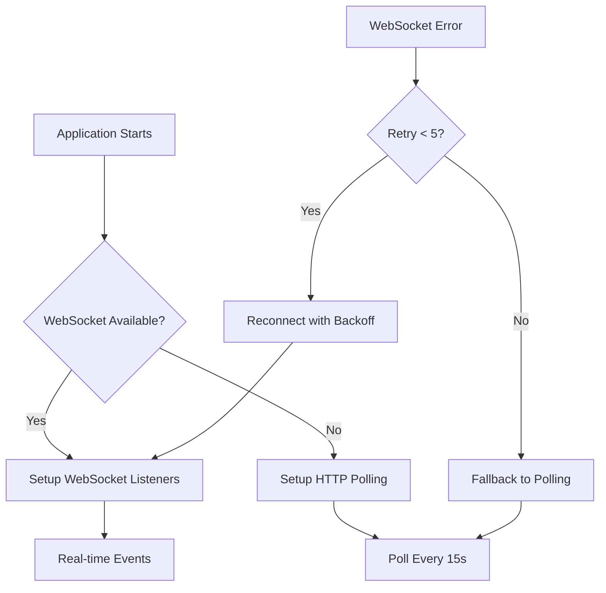

<p align="center">
  <a href="http://nestjs.com/" target="blank"></a>
</p>

[circleci-image]: https://img.shields.io/circleci/build/github/nestjs/nest/master?token=abc123def456
[circleci-url]: https://circleci.com/gh/nestjs/nest

  <p align="center">A progressive <a href="http://nodejs.org" target="_blank">Node.js</a> framework for building efficient and scalable server-side applications.</p>
    <p align="center">
<a href="https://www.npmjs.com/~nestjscore" target="_blank"></a>
<a href="https://www.npmjs.com/~nestjscore" target="_blank"></a>
<a href="https://www.npmjs.com/~nestjscore" target="_blank"></a>
<a href="https://circleci.com/gh/nestjs/nest" target="_blank"></a>
<a href="https://discord.gg/G7Qnnhy" target="_blank"></a>
<a href="https://opencollective.com/nest#backer" target="_blank"></a>
<a href="https://opencollective.com/nest#sponsor" target="_blank"></a>
  <a href="https://paypal.me/kamilmysliwiec" target="_blank"></a>
    <a href="https://opencollective.com/nest#sponsor"  target="_blank"></a>
  <a href="https://twitter.com/nestframework" target="_blank"></a>
</p>
  <!--[](https://opencollective.com/nest#backer)
  [](https://opencollective.com/nest#sponsor)-->

## Description

[Nest](https://github.com/nestjs/nest) framework TypeScript starter repository.

## Project setup

```bash
$ npm install
```

## Compile and run the project

```bash
# development
$ npm run start

# watch mode
$ npm run start:dev

# production mode
$ npm run start:prod
```

## Run tests

```bash
# unit tests
$ npm run test

# e2e tests
$ npm run test:e2e

# test coverage
$ npm run test:cov
```

## Deployment

When you're ready to deploy your NestJS application to production, there are some key steps you can take to ensure it runs as efficiently as possible. Check out the [deployment documentation](https://docs.nestjs.com/deployment) for more information.

If you are looking for a cloud-based platform to deploy your NestJS application, check out [Mau](https://mau.nestjs.com), our official platform for deploying NestJS applications on AWS. Mau makes deployment straightforward and fast, requiring just a few simple steps:

```bash
$ npm install -g @nestjs/mau
$ mau deploy
```

With Mau, you can deploy your application in just a few clicks, allowing you to focus on building features rather than managing infrastructure.

## Resources

Check out a few resources that may come in handy when working with NestJS:

- Visit the [NestJS Documentation](https://docs.nestjs.com) to learn more about the framework.
- For questions and support, please visit our [Discord channel](https://discord.gg/G7Qnnhy).
- To dive deeper and get more hands-on experience, check out our official video [courses](https://courses.nestjs.com/).
- Deploy your application to AWS with the help of [NestJS Mau](https://mau.nestjs.com) in just a few clicks.
- Visualize your application graph and interact with the NestJS application in real-time using [NestJS Devtools](https://devtools.nestjs.com).
- Need help with your project (part-time to full-time)? Check out our official [enterprise support](https://enterprise.nestjs.com).
- To stay in the loop and get updates, follow us on [X](https://x.com/nestframework) and [LinkedIn](https://linkedin.com/company/nestjs).
- Looking for a job, or have a job to offer? Check out our official [Jobs board](https://jobs.nestjs.com).

## Support

Nest is an MIT-licensed open source project. It can grow thanks to the sponsors and support by the amazing backers. If you'd like to join them, please [read more here](https://docs.nestjs.com/support).

## Stay in touch

- Author - [Kamil Myśliwiec](https://twitter.com/kammysliwiec)
- Website - [https://nestjs.com](https://nestjs.com/)
- Twitter - [@nestframework](https://twitter.com/nestframework)

## License

Nest is [MIT licensed](https://github.com/nestjs/nest/blob/master/LICENSE).

# Hybrid Provider Setup Documentation

This document explains our hybrid HTTP/WebSocket provider architecture for optimal blockchain interaction.

## Architecture Overview

We use a **dual-provider approach** to maximize efficiency and reliability:

- **HTTP Provider**: For all contract operations (transactions, queries, gas estimation)
- **WebSocket Provider**: For real-time event listening only

## Provider Configuration

### Environment Variables

```env
# HTTP RPC for contract operations
BASE_SEPOLIA_RPC_URL=https://base-sepolia.g.alchemy.com/v2/YOUR_API_KEY

# WebSocket for real-time events
BASE_SEPOLIA_WSS_URL=wss://base-sepolia.g.alchemy.com/v2/YOUR_API_KEY

# Chain ID
BASE_SEPOLIA_CHAIN_ID=84532
```

### Provider Injection

```typescript
// ContractModule provides two separate providers
providers: [
  {
    provide: 'HTTP_PROVIDER',
    useFactory: () => new ethers.JsonRpcProvider(process.env.BASE_SEPOLIA_RPC_URL),
  },
  {
    provide: 'WS_PROVIDER',
    useFactory: () => {
      const wsUrl = process.env.BASE_SEPOLIA_WSS_URL;
      return wsUrl
        ? new ethers.WebSocketProvider(wsUrl)
        : new ethers.JsonRpcProvider(process.env.BASE_SEPOLIA_RPC_URL); // Fallback
    },
  },
]
```

## Service Usage

### ContractService (HTTP Provider)

Uses `HTTP_PROVIDER` for:
- ✅ Creating lotteries
- ✅ Querying lottery state
- ✅ Ending lotteries
- ✅ Gas estimation
- ✅ Transaction preparation

```typescript
constructor(
  @Inject('HTTP_PROVIDER') provider: ethers.JsonRpcProvider
) {
  this.provider = provider;
}
```

### LotteryListenerService (WebSocket Provider)

Uses `WS_PROVIDER` for:
- ✅ Real-time event listening
- ✅ Automatic fallback to polling if WebSocket fails

```typescript
constructor(
  @Inject('WS_PROVIDER') provider: ethers.JsonRpcProvider | ethers.WebSocketProvider
) {
  this.provider = provider;
}
```

## Why This Hybrid Approach?

### HTTP Provider Benefits
- **Reliability**: Better for request-response operations
- **Error Handling**: Easier to retry failed transactions
- **Resource Efficient**: No persistent connections for one-off operations
- **Load Balancing**: Works better with load balancers

### WebSocket Provider Benefits
- **Real-time**: Immediate event notifications
- **Efficiency**: No polling overhead
- **Push Notifications**: Server pushes events as they happen
- **Lower Latency**: Faster event detection

## Event Handling Flow



## Error Handling & Resilience

### WebSocket Error Recovery
1. **Connection Errors**: Automatic reconnection with exponential backoff
2. **Filter Expiry**: Automatic recreation of event listeners
3. **Network Issues**: Graceful fallback to HTTP polling
4. **Max Retries**: After 5 failed attempts, switches to polling mode

### HTTP Provider Resilience
- Each request is independent
- Built-in retry mechanisms
- No connection state to manage
- Works with any HTTP load balancer

## Monitoring & Logging

### Startup Logs
```
🌐 Creating HTTP provider for contract operations
🔌 Creating WebSocket provider for event listening
🌐 ContractService initialized with HTTP provider
🔌 LotteryListenerService initialized with WebSocket provider
```

### Event Logs
```
🎯 Lottery Created: 123
✅ Updated raffle 123 - Lottery Created

🎫 Ticket Purchased: 456
✅ Updated ticket 456 - Ticket Purchased

🏆 Lottery Ended: 789
✅ Lottery 789 ended successfully
```

### Error Logs
```
❌ WebSocket error: Connection lost
⚠️ Connection error, attempting to reconnect (1/5) in 5000ms...
🔄 Max reconnection attempts reached. Switching to polling mode.
```

## Testing Your Setup

Run the test script to verify both providers:

```bash
node test-providers.js
```

Expected output:
```
🧪 Testing Provider Setup...

📋 Configuration:
HTTP URL: ✅ Configured
WebSocket URL: ✅ Configured

🌐 Testing HTTP Provider...
✅ HTTP Provider: Connected, latest block: 12345
✅ HTTP Provider: Network base-sepolia (chainId: 84532)

🔌 Testing WebSocket Provider...
✅ WebSocket Provider: Connected, latest block: 12345
✅ WebSocket Provider: Network base-sepolia (chainId: 84532)
🎧 Testing event listening capability...
📦 New block received via WebSocket: 12346

🎉 Provider Test Summary:
- HTTP Provider: Ready for contract operations
- WebSocket Provider: Ready for real-time events

Your hybrid setup is working correctly! 🚀
```

## Best Practices

### ✅ Do's
- Use HTTP for all contract calls and transactions
- Use WebSocket only for event listening
- Always have fallback mechanisms
- Monitor connection health
- Log provider status changes

### ❌ Don'ts
- Don't use WebSocket for one-off contract calls
- Don't rely solely on WebSocket without fallback
- Don't create multiple WebSocket connections unnecessarily
- Don't ignore connection error handling

## Troubleshooting

### Common Issues

#### WebSocket Connection Fails
- **Symptom**: Events not received in real-time
- **Check**: WSS URL is correct and accessible
- **Solution**: Service automatically falls back to HTTP polling

#### HTTP Requests Timeout
- **Symptom**: Contract operations fail
- **Check**: HTTP RPC URL and API limits
- **Solution**: Verify provider status and API key

#### Events Missing
- **Symptom**: Database not updating after blockchain events
- **Check**: Both WebSocket connection and polling logs
- **Solution**: Review event handler error logs

### Health Checks

Monitor these indicators:
- WebSocket connection status
- Last processed block number
- Event processing success rate
- Provider response times

## Performance Metrics

With this hybrid setup, you should expect:
- **Event Latency**: < 1 second (WebSocket) or ~15 seconds (polling)
- **Contract Call Latency**: 200-500ms (HTTP)
- **Connection Reliability**: 99.9% uptime with auto-recovery
- **Resource Usage**: Minimal (1 persistent WebSocket + ephemeral HTTP)

This architecture provides the perfect balance of **real-time performance** and **operational reliability** for production blockchain applications.
